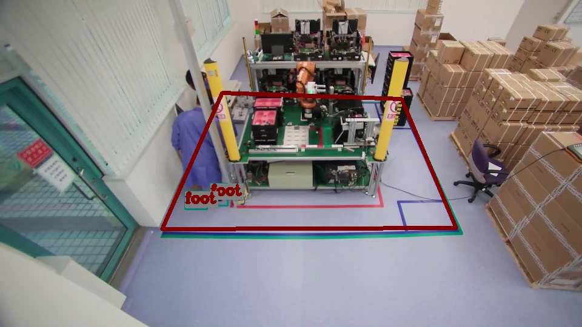

# Robot-Hazard-Prevention

Factories commonly have restricted areas to keep workers safe from moving automation or robots. In this scenario you will see how a work place is designated as a restricted area to prevent people from entering it. If someone enters the restricted area, the region will turn red.

## Clone the repository
### The samples path are designed at ~/Downloads

Follow the command below to clone the repository:

```
$ git clone https://github.com/IST-EVA-Support/ai-quick-start-suite.git
$ mv ai-quick-start-suite ~/Downloads
```

This might required you to input your adlink account and password. If you do not have the permission, please contact to paul.lin@adlinktech.com.

## Algorithm Description

This scenario algorithm is same as [AI Safety](../ai-safety).

## Compilation

This scenrio compilation is same as [AI Safety](../ai-safety).

## Run the plugin

There exists one test optimized models for JNX(NVIDIA NX) in /ai-quick-start-suite/src/robot-hazard-prevention/NX:

1. yolov4-tiny-608.engine for pose detection

   (if you are using other architecture, you can optimize it through EVASDK user manual by using /ai-quick-start-suite/src/robot-hazard-prevention/misc/yolov4-tiny-608.onnx)
   Convert onnx model as by tensorrt. Refer to portal[https://eva-support.adlinktech.com/docs/yolov4nbsp] for more detail.

For Neon-JT2 / Neon-JNO
```
$ /usr/src/tensorrt/bin/trtexec --onnx=/home/adlink/Downloads/ai-quick-start-suite/src/robot-hazard-prevention/misc/yolov4-tiny-608.onnx --buildOnly \
--saveEngine=/home/adlink/Downloads/ai-quick-start-suite/src/robot-hazard-prevention/misc/yolov4-tiny-608.engine \
--maxBatch=4 --fp16 --workspace=3000 --verbose
``` 


and other required materials needed in /ai-quick-start-suite/src/robot-hazard-prevention/NX:

1. area.txt 

   this file could be generated through widget. This widget located in [area-generator.py](../../widgets/area-generator.py). Follow the [instructions here](../../widgets/readme.md) to generate your own area.txt.

2. labels.txt

   lable file used by yolov4-tiny-608.engine.

Test videos are located in [Data](./Data) folder. The videos are used for testing this plugin.

For running this plugin, run the command below for testing:
For Neon-NX
```
$ gst-launch-1.0 filesrc location=Data/front.mp4 ! decodebin ! nvvideoconvert ! videoconvert ! videoscale ! video/x-raw, width=960, height=540 ! adrt model=NX/yolov4-tiny-608.engine scale=0.004 mean="0 0 0" rgbconv=true ! adtrans_yolo label=NX/label.txt input-width=608 input-height=608 blob-size="19,38" mask="(3,4,5),(1,2,3)" anchor="(10,14),(23,27),(37,58),(81,82),(135,169),(344,319)" class-num=1 use-sigmoid=True ! geocheck alert-area-def=NX/area.txt object-name=foot ! videoconvert ! ximagesink sync=false
```

For Neon-JT2 / Neon-JNO
```
$ gst-launch-1.0 filesrc location=Data/front.mp4 ! decodebin ! nvvideoconvert ! videoconvert ! videoscale ! video/x-raw, width=960, height=540 ! adrt model=misc/yolov4-tiny-608.engine scale=0.004 mean="0 0 0" rgbconv=true ! adtrans_yolo label=NX/label.txt input-width=608 input-height=608 blob-size="19,38" mask="(3,4,5),(1,2,3)" anchor="(10,14),(23,27),(37,58),(81,82),(135,169),(344,319)" class-num=1 use-sigmoid=True ! geocheck alert-area-def=NX/area.txt object-name=foot ! videoconvert ! ximagesink sync=false
```

You will see the following result displayed:



Illustrated red area denotes the pre-defied ara provide by user. The person's foot is the target that can not occur in the area. This object name can set in the property, object-name, of the plugin. The other property, limit-num, can set the object number that can or cannot appear in the area. The limit-num = 0 means cannot exist the object; limit-num > 0 means can exist specific number of the object. This scenario can widely extended to any situation that illegal object is trained in the model and check whether it is appear in the area or not.

